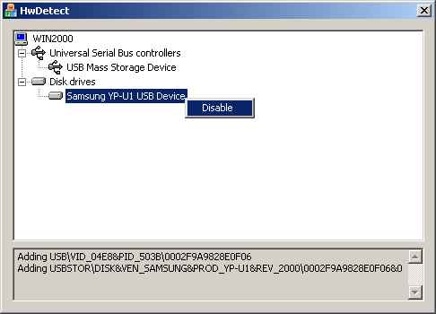

# About
Hot-pluggable device is now a big threat to IT security. In this article, we will try to develop a user-mode application to detect device change on the system, i.e. plug-in a USB drive, iPod, USB wireless network card, etc. The program can also disable any newly plugged devices. We will get a basic idea on how this works and talk about its limitations at the end of this article. 

For details see orignal [article](https://www.codeproject.com/Articles/14500/Detecting-Hardware-Insertion-and-or-Removal) on CodeProject from [Sam NG](https://www.codeproject.com/script/Membership/View.aspx?mid=1884307)

# Changes
In this version following changes are merged:

[How do I get the drive letter for a USB drive?](https://www.codeproject.com/Messages/3169301/Re-How-do-I-get-the-drive-letter-for-a-USB-drive.aspx)

and a modified version I found on

[Github](https://github.com/haoict/MFC-HardwareDetect)

# Prequesit

[Microsoft Visual C++ 2015 Redistributable x86](https://www.microsoft.com/en-us/download/details.aspx?id=52685)

# Revision

| Rev  | Date   | Change  | Comment  |
|---|---|---|---|
|1.0.0.1|19 Jun 2006|Initial version by author|   |
|1.0.0.2|2007|lost version|   |
|1.0.0.3|17 Mar 2020| Merged MFC-HardwareDetect and "add driveletter" feedback of original aticle, checked structure, updated to VS2019 and put on github to not loose it again |   |
|   |   |   |   |

# License
[Open license, use at your own risk, enjoy](https://www.codeproject.com/Messages/3209423/Re-License.aspx)